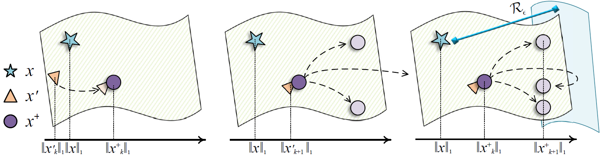

# Diversity_Probe (ACM MM'2023)

Pytorch implementation of Single Domain Generalization via Unsupervised Diversity Probe.



## Requirements

- Linux
- Python 3.8
- Pytorch 1.8.0
- Torchvision 0.9.0
- NVIDIA GPU + CUDA CuDNN

## Setting up the data

**Note**: You need to download the data if you wish to train your own model.

Download the digits dataset from this [link](https://pan.baidu.com/s/15XTZxbFY_JnTk_FZB4-1Jw )[BaiDuYunDisk] and its extracted code: `xcl3`. Please extract it inside the `data` directory

```shell
cd data
unzip digits.zip
cd ..
```

## Evaluating the model

Pretrained task model is available at this [link](https://pan.baidu.com/s/1DYPud3q-SH7ZGeJKfbrnZQ)[BaiDuYunDisk] and its extracted code:`dp46`. Download and extract it in the `models_pth` directory.

In `runDivPro.py`:

- Specify the output directory to save the results in `--dir`.
- Turn on the evaluation in`--eval`
- Run `python runDivPro.py --dir SAVE_DIR --eval True`

## Training the model

- Specify the output directory to save the results in `--dir`.
- Run `python runDivPro.py --dir SAVE_DIR`

## Acknowledgement

We thank the following authors for releasing their source code, data and models:

- [Progressive Domain Expansion Network for Single Domain Generalization](https://arxiv.org/abs/2103.16050)
- [Learning to Diversify for Single Domain Generalization](https://arxiv.org/abs/2108.11726)
